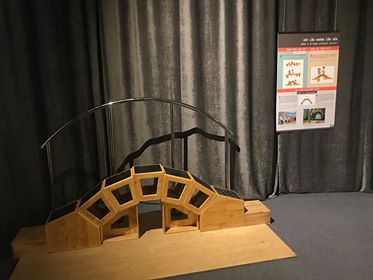

Cầu vòm
=======

  Hình thực tế ©ExploraScience

Việc điều hướng các lực về các cột trụ khiến cầu vòm có thể đứng vững mà không cần chất kết dính. Khách tham quan có thể tự xây một chiếc cầu như vậy và đi qua. Đây là một phát minh lớn (tuy không so được với việc phát minh ra bánh xe) góp phần thúc đẩy việc giao lưu và phát triển kinh tế, văn hóa xã hội. Nền văn minh cổ Hy-La đã có thời kỳ phát triển rực rỡ cũng một phần do phát minh này. Hiện nay, kết cấu dạng vòm vẫn được sử dụng phổ biến trong kiến trúc.

.. note:: thiếu phần phân tích lực đã làm ? (tuy nhiên không biết có hay hay ko)

Bạn cần làm gì?
---------------

Hãy xây dựng một chiếc cầu từ các khối gỗ cho sẵn!

Bạn sẽ thấy gì?
---------------

Dù không có cột chống và không có chất kết dính giữa các khối gỗ nhưng chiếc cầu này rất vững chãi và bạn có thể đi qua được dễ dàng.

Tại sao lại như vậy?
--------------------

- Chiếc cầu dạng vòm mà bạn vừa xây dựng có thể đứng vững được là do tải trọng của cầu đã được chuyển xuống trụ cầu ở hai bên. Kiến trúc dạng vòm rất phổ biến và đa dạng ở thời kỳ La Mã.

- Keystone trong tiếng Anh chỉ viên đá cuối cùng được đặt lên và cho phép vòm chịu được trọng tải. Cách dùng từ keystone với nghĩa thông dụng “yếu tố quyết định” bắt nguồn từ vai trò của viên đá này.

Thông tin thêm
--------------

- Keystone có thể là 1 khối khác, nhưng là khối giữa thì dễ hơn.

- Chưa xác định được ai là tác giả của phát minh này, chỉ biết nó đã được dùng từ thời cổ La mã cách đây hơn 2000 năm, người La Mã vô cùng xuất sắc trong việc cải tiến "kiến trúc mái vòm" và đến nay nhiều công trình dạng cầu vòm vẫn còn đứng vững.

- Kết cấu này đơn giản, dễ chế tạo và đã được dùng khắp nơi trên thế giới (Cầu Gard (Pháp) do đế chế La Mã xây dựng để đưa nước từ Uzès tới Nîmes, đấu trường La Mã Colosseum - một trong những biểu tượng của kiến trúc vòm), và cả ở VN (Di sản văn hóa thế giới Thành nhà Hồ (tỉnh Thanh Hóa) được xây dựng từ thế kỉ 14 với những vòm đá khá lớn) trong thời kỳ chưa có chất kết dính đặc biệt tốt như xi măng. Người xưa chỉ mới biết dùng vôi, vôi kết dính đá khá tốt, nhưng rất chậm đông cứng nên khó xử dụng. Trong tự nhiên, vỏ trứng, vỏ ốc cũng là những kết cấu dạng vòm có khả năng chịu lực rất lớn.
