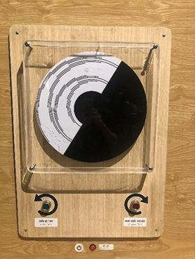

Đĩa Benham
==========

Chiếc đĩa chỉ có các vạch trắng và đen xen kẽ nhau nhưng khi cho đĩa quay thì lại thấy xuất hiện thêm nhiều màu khác trên đĩa. Thí nghiệm cho thấy mắt người bao gồm các tế bào nhạy cảm với các màu sắc khác nhau và có thời gian phản xạ khác nhau.

BẠN CẦN LÀM GÌ?

- Bấm nút màu xanh để làm quay đĩa tròn và quan sát bề mặt đĩa. Bấm nút màu đỏ để dừng lại.

BẠN SẼ THẤY GÌ?

- Khi quay nhanh, các vạch đen trắng nối tiếp nhau tạo thành các cung tròn có màu sắc.
- Nhiều người cho rằng họ nhìn thấy màu xanh lá cây ở vành ngoài cùng, một số lại cho rằng họ thấy màu nâu đỏ trong khi vài người lại nói họ không nhìn thấy màu gì. Còn bạn, bạn đã thấy màu gì?

TẠI SAO LẠI NHƯ VẬY?

- Võng mạc mắt của chúng ta có 3 loại tế bào hình nón nhận biết 3 màu ánh sáng: đỏ, xanh lục và xanh lam. Ba loại tế bào này sẽ nhận ánh sáng và truyền tín hiệu đến bộ não, sau đó bộ não tổng hợp các tín hiệu và nhờ đó chúng ta nhìn thấy được các màu sắc.
- Tuy nhiên, tốc độ phản hồi tín hiệu của 3 loại tế bào này không giống nhau. Ví dụ, khi tế bào nhạy cảm với ánh sáng xanh lam chưa được “đánh thức”, thì sự kết hợp của hai tín hiệu còn lại (đỏ và xanh lục) sẽ cho ra màu vàng dù rằng vùng trắng đang trôi qua trước mắt bạn.
- Độ nhạy tương đối của các tế bào hình nón của mỗi người là khác nhau nên màu sắc quan sát được cũng sẽ khác nhau.

THÔNG TIN THÊM:

- Con quay Benham được đặt theo tên của nhà sản xuất đồ chơi người Mỹ - Charles Benham, người đã sáng tạo ra nó vào năm 1895 khi ông chú ý vào các dải màu đen trắng mà ông dán trên bề mặt của 1 con quay. Con quay Benham tạo ra ảo giác về màu sắc khi các mẫu hình đen và trắng thay đổi liên tục, nhanh chóng. Khi bánh xe xoay tít, các vòng cung màu phảng phất, được gọi là màu Fechner, hiển hiện ở những khu vực khác nhau trên bề mặt bánh xe. Các vạch màu đen trên đĩa tròn phải ngắn và mảnh, nếu không màu sắc sẽ không xuất hiện.

(http://khampha.vn/khoa-hoc-cong-nghe/ao-thi-xoay-tit-ky-la-c7a199602.html)

(https://www.exploratorium.edu/snacks/benhams-disk)

- Nhiều năm trước khi đĩa Benham xuất hiện, Gustav Fechner và Hermann von Helmholtz đã nhận ra rằng những chiếc đĩa quay có màu trắng và đen xen kẽ trên nó có thể tạo ra những màu sắc khác. Những màu này còn được biết đến với các tên gọi như "subjective colors," "Fechner-Benham colors," "Prevost-Fechner-Benham colors," "polyphan colors," hay "pattern-induced flicker colors" (PIFCs). Đĩa Benham (Benham's top hoặc Benham's disk) là "công cụ" giải thích phổ biến nhất cho hiện tượng này.

(https://en.wikipedia.org/wiki/Fechner_color)
