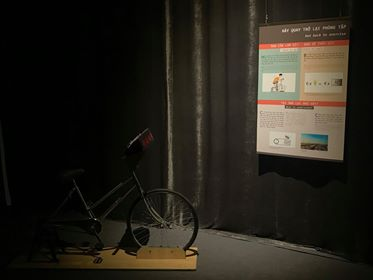

Dynamo xe đạp
=============

Áp dụng thực tế của cơ chế chuyển hóa cơ năng sang điện năng với những thử thách trên một chiếc xe đạp đặc biệt.

BẠN CẦN LÀM GÌ?

- Hãy ngồi lên xe và đạp. Thử thay đổi tốc độ đạp và theo dõi điện áp trên Vôn kế. Sau đó, hãy cố giữ cho điện áp luôn nằm trong một khoảng ổn định (ví dụ: 10-12V) rồi bật lần lượt từng công tắc đèn. Bạn cảm thấy như thế nào?.

BẠN SẼ THẤY GÌ?

- Bạn đạp càng nhanh, điện áp hiển thị trên Vôn kế càng tăng. Cùng một điện áp, càng bật nhiều bóng đèn bạn càng phải gắng sức để duy trì được điện áp đó.

TẠI SAO LẠI NHƯ VẬY?

- Cơ năng do bạn tạo ra khi đạp xe được máy phát điện biến thành điện năng để làm sáng các bóng đèn. Khi bạn tăng tốc độ đạp, các thanh nam châm nối với bàn đạp di chuyển nhanh hơn, khiến điện áp tạo ra càng lớn. Đây là hiện tượng cảm ứng điện từ, được phát hiện bởi M. Faraday (1831) và J. Henry (1832).
- Càng nhiều bóng đèn được bật lên thì từ trường hãm gây ra bởi bản thân máy phát càng lớn nên bạn phải mất nhiều sức để giữ cho chúng sáng.

THÔNG TIN THÊM:

- Mô tả về đèn xe đạp dynamo: Là thiết bị bao gồm nắp quay ở phía trên, nam châm vĩnh cửu có thể quay ở trong nối cùng trục với nắp quay và một cuộn dây dẫn đứng yên. Nam châm vĩnh cửu này được đặt trong lòng ( hoặc đặt trước) một cuộn dây dẫn khép kín có lõi bằng sắt non. Khi ta đặt núm tì sát vào bánh xe, lúc bánh xe di chuyển, sẽ làm núm xoay theo, kéo theo đó là trục quay có gắn thanh nam châm cũng xoay theo. Khi thanh nam châm xoay (trong lòng) hoặc trước cuộn dây, số đường sức từ xuyên qua tiết diện S của dây dẫn đứng yên biến thiên, nên tạo ra hiện tượng cảm ứng điện từ, tạo ra dòng điện cảm ứng xoay chiều tạo ra dòng điện. (https://papilo.vn/so-sanh-den-xe-dap-dinamo-va-den-led/)
- Hãy so sánh chỗ giống nhau và khác nhau về cấu tạo và hoạt động của dynamo ở xe đạp và máy phát điện xoay chiều trong công nghiệp:

  + Giống nhau: Đều có nam châm và cuộn dây dẫn, khi cho một trong hai bộ phận quay thì xuất hiện dòng điện xoay chiều.
  + Khác nhau : dynamo có kích thước nhỏ hơn, công suất phát điện nhỏ hơn, hiệu điện thế, cường độ dòng điện ở đầu ra đều nhỏ hơn máy phát điện rất nhiều. (https://baitapsgk.com/lop-9/vat-ly-lop-9/bai-c3-trang-93-sgk-vat-li-9-hay-so-sanh-cho-giong-nhau-va-khac-nhau.html)

- Ứng dụng:

  + Máy phát điện là thiết bị biến đổi cơ năng thành điện năng thông thường sử dụng nguyên lý cảm ứng điện từ. Nguồn cơ năng sơ cấp có thể là các động cơ tua bin hơi, tua bin nước, động cơ đốt trong, tua bin gió hoặc các nguồn cơ năng khác.
  + Máy phát điện đầu tiên được sáng chế vào năm 1831 là đĩa Faraday, do nhà khoa học người Anh Michael Faraday phát minh ra. (https://vi.wikipedia.org/wiki/M%C3%A1y_ph%C3%A1t_%C4%91i%E1%BB%87n)
