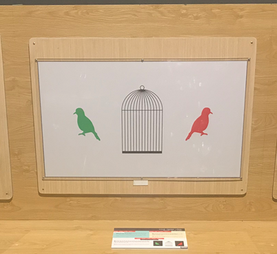

Chim trong lồng
===============

Khi nhìn đủ lâu một màu sắc, thì tế bào nhạy cảm với màu đó bị mỏi và không phản ứng với các kích thích khác sau đó. Khách tham quan sẽ trải nghiệm một cách an toàn điều này khi nhìn lần lượt vào các chú chim được chiếu sáng rõ và vào một chiếc lồng rỗng.

BẠN CẦN LÀM GÌ?

- Hãy tập trung nhìn vào con chim đỏ khoảng 15-20 giây, sau đó nhanh chóng nhìn qua lồng. Sau một lúc bạn có thể làm tương tự như vậy với con chim xanh.

BẠN SẼ THẤY GÌ?

- Sau khi nhìn lâu vào chim đỏ rồi nhìn qua lồng chim, ta thấy xuất hiện một chú chim màu xanh nhạt trong lồng. Ngược lại, một con chim tím nhạt sẽ xuất hiện trong lồng khi làm tương tự với chim xanh.

TẠI SAO LẠI NHƯ VẬY?

- Khi bạn nhìn vào chú chim đỏ, các tế bào nón nhạy cảm với màu đỏ sẽ trở nên “mệt mỏi”. Do đó, khi bạn nhìn vào chiếc lồng trắng, hai tế bào nón còn lại (xanh lục và xanh lam) sẽ hoạt động tốt hơn, do đó bạn nhìn thấy con chim màu xanh nhạt.

THÔNG TIN THÊM:

- Những hình ảnh kì ảo thấy được ở mô hình này được gọi là dư ảnh. Dư ảnh là hình ảnh được lưu lại trong bộ não của bạn ngay cả khi dừng nhìn vào vật thể. (https://www.exploratorium.edu/snacks/bird-in-cage)
- Traumatrope là một trò chơi quang học phổ biến vào thế kỷ 19. Hai bức ảnh được gắn trên mỗi mặt của 1 chiếc đĩa nhỏ và gắn với 2 mảnh dây đối diện nhau. Khi những mảnh dây dược quay nhanh giữa các ngón tay, 2 bức ảnh dường như hoà lẫn thành một do hiện tượng lưu ảnh trên võng mạc. (https://en.wikipedia.org/wiki/Thaumatrope)
- Ứng dụng trong đời sống: Bác sỹ mang đồ màu xanh khi phẫu thuật để hạn chế mỏi mệt về thị giác khi phải nhìn quá nhiều vào màu đỏ của máu trong các cơ quan của cơ thể bệnh nhân.

(https://vnexpress.net/tai-sao-bac-si-phau-thuat-mac-trang-phuc-mau-xanh-3452758.html)

(https://www.livescience.com/32450-why-do-doctors-wear-green-or-blue-scrubs-.html)
