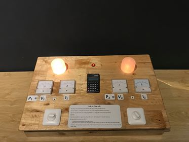

Độ sáng và Công suất
====================

Điện áp và cường độ dòng điện đi qua 2 bóng đèn (đèn LED và đèn dây tóc) khác nhau nhưng công suất tiêu thụ của 2 bóng đèn lại xấp xỉ nhau.

BẠN CẦN LÀM GÌ?

Nhấn nút để bật đèn, sau đó xoay để điều chỉnh cho chúng sáng gần như nhau. Đọc các giá trị điện áp và cường độ dòng điện qua từng đèn và tính công suất tiêu thụ của chúng bằng công thức P = U.I.

BẠN SẼ THẤY GÌ?

Điện áp và cường độ dòng điện đi qua 2 bóng đèn khác nhau nhưng công suất tiêu thụ của 2 bóng thì lại xấp xỉ như nhau.

TẠI SAO LẠI NHƯ VẬY?

Thí nghiệm này sử dụng hai bóng đèn dây tóc có cùng hiệu suất chiếu sáng (12 lumen/W). Bóng đèn thứ nhất sử dụng hiệu thế lưới điện bình thường (220V) còn bóng thứ hai sử dụng hiệu điện thế thấp (qua bộ chuyển đổi 12V). Hai bóng đèn này có cùng cơ chế phát sáng, do đó để có độ sáng bằng nhau, chúng phải có công suất bằng nhau.

Với cường độ dòng điện bé nhưng hiệu điện thế lớn, bóng đèn cũng có cùng độ sáng với khi có cường độ dòng điện lớn và hiệu điện thế bé.

Để có cùng độ sáng, đèn LED bền hơn và tiêu thụ điện năng ít hơn. Do đó, sử dụng LED đang là xu thế hiện nay.

THÔNG TIN THÊM:

- Diode bán dẫn là linh kiện bán dẫn có 1 tiếp giáp P-N, có vỏ bọc bằng thủy tinh, nhựa hoặc kim loại. Có 2 dây dẫn ra là 2 điện cực: anot (A) và catot (K).
- Tại sao đèn sợi đốt tiêu thụ điện lớn hơn đèn led? (có thể yêu cầu cảm nhận nhiệt độ 2 đèn)

  + Đèn led nhiệt lượng tỏa ra ít, phát ra ánh sáng nhìn thấy trong khi đó đèn sợi đốt tỏa ra nhiệt lượng lớn, nên điện năng tiêu thụ nhiều hơn.
  + Khi đèn sợi đốt làm việc, chỉ khoảng 5% đến 10% điện năng tiêu thụ của đèn biến đổi thành quang năng, phần còn lại tỏa nhiệt. Nếu sờ vào bóng đèn đang làm việc, sẽ thấy nóng và có thể bỏng.

- So sánh ưu và nhược điểm của đèn led, đèn huỳnh quang và đèn sợi đốt?

  + Đèn sợi đốt:

    * Giá rẻ
    * Phát ra phổ liên tục.
    * Hiệu suất phát quang thấp (dưới 10%), tỏa nhiều nhiệt
    * Tuổi thọ thấp (khoảng 1000 giờ)
    * Khi làm việc, sợi đốt bị đốt nóng ở nhiệt độ cao nên nhanh hỏng.
    * Nguyên lí hoạt động: Khi đóng điện, dòng điện chạy trong dây tóc đèn làm dây tóc đèn nóng lên đến nhiệt độ cao, dây tóc đèn phát sáng.

  + Đèn huỳnh quang:

    * Giá rẻ
    * Phát ra phổ không liên tục
    * Hiệu suất phát quang cao (20% đến 25%)
    * Tuổi thọ cao (khoảng 8000 giờ)
    * Nguyên lí hoạt động: Khi đóng điện, hiện tượng phóng điện giữa 2 điện cực phát ra tia tử ngoại. Tia tử ngoại tác dụng vào lớp bột huỳnh quang làm đèn phát sáng

  + Đèn led:

    * Giá cao
    * Phát ra phổ không liên tục
    * Hiệu suất phát quang cao (30%)
    * Tuổi thọ cao khoảng 50000 giờ.
    * Tỏa ít nhiệt nên ít tiêu hao năng lượng.
    * Nguyên lí hoạt động: LED dựa trên công nghệ bán dẫn. Hoạt động của LED giống với nhiều loại điốt bán dẫn (1). Khối bán dẫn loại p chứa nhiều loại lỗ trống tự do mang điện tích dương nên khi ghép với khối bán dẫn n (chứa các điện tử tự do) thì các lỗ trống này có xu hướng chuyển động khuếch tán sang khối n. Cùng lúc khối p lại nhận thêm các điện tử (điện tích âm) từ khối n chuyển sang. Kết quả là khối p tích điện âm (thiếu hụt lỗ trống và dư thừa điện tử) trong khi khối n tích điện dương (thiếu hụt điện tử và dư thừa lỗ trống). Ở biên giới hai bên mặt tiếp giáp, một số điện tử bị lỗ trống thu hút và khi chúng tiến lại gần nhau, chúng có xu hướng kết hợp với nhau tạo thành các nguyên tử trung hòa. Quá trình này có thể giải phóng năng lượng dưới dạng ánh sáng (hình ảnh phía dưới)

- Lựa chọn đèn chiếu sáng tiết kiệm năng lượng (http://tietkiemnangluong.vn/d6/news/Lua-chon-den-chieu-sang-tiet-kiem-nang-luong-116-126-3332.aspx)
- Lịch sử tìm ra các loại đèn:

  + Năm 1879: Thomas Edison (nhà phát minh người Mĩ) được xem đã phát minh ra đèn sợi đốt đầu tiên.
  + Năm 1901: Peter Cooper Hewitt (kĩ sư người Mĩ) đã phát minh ra đèn hơi thủy ngân.
  + Năm 1962: Nick Holonyak (kĩ sư người Mĩ) phát minh ra đèn LED.
