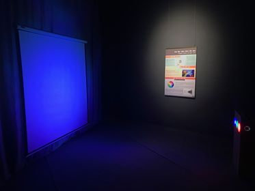

Cộng màu
========

Bằng cách điều chỉnh độ sáng của ba đèn đỏ, xanh lục, xanh lam, người chơi có thể tạo ra bất kỳ màu sắc nào khác trên màn chiếu. Đây là quy luật cộng màu được dùng trong các màn hình vô tuyến hay máy tính, nhưng cũng là cách não bộ tổng hợp màu sắc từ các tế bào hình nón trong võng mạc..

BẠN CẦN LÀM GÌ?

- Hãy điều chỉnh độ sáng của các đèn và quan sát sự thay đổi các màu trên màn chiếu.
- Hãy đứng chắn trước đèn ở các vị trí khác nhau và quan sát bóng của mình có những màu gì. Sau đó, hãy nhờ một người bạn thay đổi độ sáng của các đèn để xem màu của bóng thay đổi như thế nào.

BẠN SẼ THẤY GÌ?

- Khi điều chỉnh độ sáng của các đèn, trên màn chiếu sẽ xuất hiện các vùng màu khác nhau. Khi chắn trước đèn, bóng của bạn không chỉ có màu đen mà còn có nhiều màu khác nhau tùy thuộc vào màu của đèn mà bạn chắn.

TẠI SAO LẠI NHƯ VẬY?

- Trong trò chơi này, các màu sắc bạn quan sát được là sự kết hợp khác nhau của ba màu: đỏ, xanh lam và xanh lục, ví dụ: màu đỏ + màu xanh lục = màu vàng. Tổng hợp cả ba màu với cường độ bằng nhau, ta sẽ thu được màu trắng hoặc màu xám.
- Mỗi đèn cho một khoảng bóng khác nhau, màu sắc của bóng bạn quan sát được tùy thuộc vào việc bạn chắn những đèn nào. Ví dụ, bạn chắn đèn màu đỏ, bóng của bạn sẽ có màu xanh lơ. Ta thu được bóng màu đen khi bạn che cả 3 đèn.

THÔNG TIN THÊM:

- Màu trắng quan sát trên màn chiếu có giống màu trắng của ánh sáng Mặt trời không?

  + Không. Nó chỉ giống trong cảm nhận của não chúng ta. Màu trắng của ánh sáng Mặt trời là tổ hợp của tất cả ánh sáng đơn sắc biến thiên liên tục từ đỏ đến tím còn màu trắng ta quan sát được chỉ kết hợp từ 3 màu cơ bản là đỏ, lục, lam (SGK VL lớp 12 Quang phổ)
  + Võng mạc mắt của chúng ta có 3 loại tế bào nón nhận biết 3 màu ánh sáng: đỏ, lục, lam. 3 loại tế bào này sẽ nhận ánh sáng và truyền tín hiệu đến bộ não, sau đó não tổng hợp các tín hiệu và nhờ đó chúng ta cảm nhận được các màu sắc.

- Ánh sáng trắng là tổ hợp của tất cả ánh sáng đơn sắc, trong đó có bảy màu cơ bản: đỏ, cam, vàng, lục, lam, chàm, tím. Ai đã tìm ra điều này? Bằng cách nào? Vào 1666, Isaac Newton (nhà toán học, vật lý người Anh) đã chứng minh rằng ánh sáng trắng là tổ hợp của tất cả ánh sáng đơn sắc, trong đó có bảy màu cơ bản: đỏ, cam, vàng, lục, lam, chàm, tím bằng cách chiếu một chùm tia sáng Mặt trời qua lăng trụ kính rồi hướng lên tường.
- Lăng kính: 1 khối chất trong suốt, đồng chất (thủy tinh, nhựa..) thường có dạng lăng trụ tam giác.
- Quang phổ: hình ảnh phân tách ánh sáng.
- Ứng dụng của phối màu trong đời sống?

  + Dùng kính lúp soi vào vùng trắng của màn hình TV, máy tính hay điện thoại thì thấy những đốm màu đỏ, xanh lục và xanh lam được xếp cạnh nhau theo từng cột và từng hàng. Từ 3 màu cơ bản này, chúng ta sẽ thấy đủ màu sắc trên màn hình.
  + Nếu không có kính lúp, ta có thể nhỏ 1 vài giọt nước lên màn hình (màn hình laptop, máy tính bảng..)
  + Các họa sĩ cũng pha trộn các màu để tạo thành các màu khác trên tranh vẽ.
