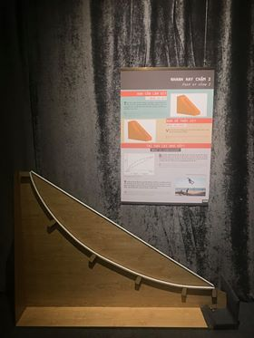

Đường cycloid
=============

Đường cong cycloid nối giữa hai điểm A và B là lộ trình nhanh nhất để một viên bi đi từ A đến B, so với bất kỳ đường thẳng hay cong nào khác nối giữa hai điểm này. Người chơi sẽ kiểm chứng điều này bằng cách đồng thời thả bi trên các đường khác nhau (dài 2 mét, đặt trên mặt đất).

BẠN CẦN LÀM GÌ?

- Theo bạn, giữa đường thẳng và đường cong trong hình, đâu sẽ là con đường nhanh hơn? Hãy giữ hai viên bi ở cùng độ cao, sau đó thả cho 2 viên lăn cùng lúc và kiểm tra dự đoán của mình.

BẠN SẼ THẤY GÌ?

- Viên bi lăn trên đường cong sẽ về đích nhanh hơn so với viên đi trên đường thẳng.

TẠI SAO LẠI NHƯ VẬY?

- Bên cạnh quãng đường đi, vận tốc là yếu tố quan trọng ảnh hưởng đến thời gian viên bi lăn về đích. Nếu tính toán kỹ, bạn sẽ thấy trên đường cong này viên bi có tốc độ trung bình cao hơn, do đó sẽ về đích sớm hơn mặc dù có quãng đường đi dài hơn.
- Trong các dạng đường cong thì đường cycloid là con đường nhanh nhất để viên bi lăn về đích. Đường này chính là quỹ đạo của một điểm trên đường tròn khi nó lăn trên một đường thẳng. Đường cycloid được ứng dụng nhiều trong kĩ thuật và đời sống.

THÔNG TIN THÊM:

- Tại sao đường cong thứ 1 về đích nhanh nhất và đường xiên thẳng chậm nhất?

  + Đường xiên thẳng: viên bi khởi đầu chậm, sau đó nhanh dần  và đến cuối con đường mới đạt tốc độ cao nhất. (Chuyển động thẳng biến đổi đều SGK VL lớp 10)
  + Đường cong thứ 1: do độ dốc ban đầu lớn nên viên bi tăng tốc rất nhanh và đến cuối vẫn tăng tốc => lợi thế về mặt thời gian nên về đích sớm nhất.
  + Đường cong thứ 2: độ dốc ban đầu rất lớn nhưng gần cuối độ dốc không còn nữa nên đến gần cuối gần như không tăng tốc nữa. => chậm hơn đường cong 1.

- Ai đã chứng minh đường cong cycloid là nhanh nhất ?

  + Cuối thế kỉ 16, Galileo Galile (nhà thiên văn học, vật lí người Ý) là người đầu tiên nghiên cứu nghiêm túc và dùng cái tên cycloid.  Đến cuối thế kỉ 17, bài toán về  “1 vật trượt xuống do trọng lực trên dạng đường cong nào thì về đích sớm nhất”, tìm đường Brachistochrone (đường nhanh nhất), đã được đặt ra. Sau đó có nhiều nhà khoa học nổi tiếng như: Anh em nhà Bernoulli (Johann và Jakob, các nhà toán học người Thụy Sĩ ), Isaac Newton (nhà toán học, vật lý người Anh). Gottfried Leibniz (nhà toán học Đức) đã chứng minh đó là đường cycloid. (https://en.wikipedia.org/wiki/Brachistochrone_curve)

-  Thả 2 viên bi tại 2 vị trí bất kỳ trên đường cong cycloid, chúng đều đến đích cùng lúc.Đây là một đặc điểm thú vị khác của đường cycloid. Điều này do nhà Vật lý, toán học và thiên văn nổi tiếng người Hà lan Chistiaan Huygens tìm ra năm 1659. Lúc đó ông gọi nó là đường Tautochrone- đường đẳng thời.(https://en.wikipedia.org/wiki/Tautochrone_curve)
-  Ứng dụng của đường cycloid trong đời sống:

  + Những đường trượt cong trong khu lướt ván.
  + Việc giải bài toán này đã đưa đến sự ra đời của môn Toán biến phân (Variable calculus)

NÂNG CAO:

- Phương pháp tính thời gian chuyển động của viên bi trên 3 đoạn đường:

  + Đường xiên thẳng: Dùng kiến thức trong chương I - Động học chất điểm (VL 10) để tính toán.
  + Đường cong: Để phép tính đơn giản, một cách gần đúng ta chia đường cong làm 2 hay nhiều đoạn thẳng. Tính thời gian rơi ở từng đoạn rồi tính tổng thời gian của các đoạn đường.

- Chứng minh kết quả của mô hình về mặt toán học: https://drive.google.com/drive/folders/1skAXqGEd-o9ZyNkqEI3IeWk15HU6EyXD
