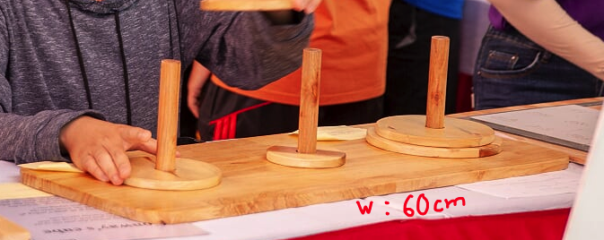
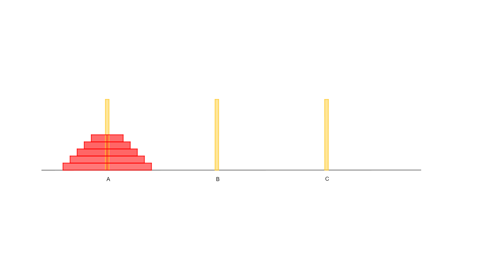

Tháp Hà Nội
===========

Bài toán Tháp Hà Nội nổi tiếng được sáng tạo bởi nhà toán học Pháp Edouard Lucas (1842-1991). Đóng góp của ông nằm tập trung ở lý thuyết số, đặc biệt là về số nguyên tố. Phép thử số nguyên tố Lucas-Lehmer mang tên ông. Nhưng Lucas cũng là một người tiên phong trong việc phổ biến các trò chơi toán học, với 4 tập Giải trí toán học và cuốn Đại số vui của ông - thực sự là một cuốn bách khoa toàn thư về giải trí toán học. Edouard Lucas cho rằng mọi khái niệm toán học đều có thể trình bày trước giới trẻ và công chúng dưới hình thức trò chơi hoặc câu đố.

Ông đã trình bày trò chơi như thế này:

  "Một người bạn của tôi, Giáo sư N. Claus de Siam [tên của Lucas sắp xếp lại] tại Đại học Li-Sou-Stian [tên trường Saint Louis của Lucas sắp xếp lại], đã ra mắt cuối năm ngoái một trò chơi độc đáo, gọi là Tháp Hà Nội. Thực ra đây là một trò đố hóc búa của những người An Nam, dù cho Giáo sư N. Claus có nói gì chăng nữa. Cái tháp này gồm nhiều tầng chồng lên nhau và bé dần[...]. Trò chơi luôn giải được dù có bao nhiêu tầng chăng nữa, chỉ có điều cần gấp đôi lượng thời gian để giải nếu ta thêm 1 tầng..."

  Hình thực tế ©ExploraScience

1. Luật chơi
------------

Di chuyển 5 đĩa ở cột A sang hết cột C với quy tắc sau: Mỗi lần chỉ di chuyển 1 đĩa và đĩa lớn không nằm trên đĩa nhỏ.

  Hình minh họa trò chơi ©ExploraScience

..
   Nguồn ảnh: https://www.geogebra.org/m/fwukmqj3

Để đưa hết 5 đĩa ở cột A sang cột C thì cần ít nhất 31 lần di chuyển.

2. Cách giải
------------

Gợi ý:

* Hãy bắt đầu bằng số đĩa ít hơn để tìm ra quy luật.
* Việc đặt chiếc đĩa đầu tiên đến cột nào trong hai cột còn lại có ý nghĩa quyết định.

Quy luật: Nếu số đĩa cần chuyển là số lẻ, thì bước đầu tiên là chuyển đĩa trên cùng đến cột đích...

3. Tìm ra số lần di chuyển
--------------------------

Gọi f(n) là số bước cần thiết để di chuyển các đĩa từ cột nguồn sang cột đích. Để chuyển n đĩa từ cột A sang cột C ta cần:

* Chuyển n-1 đĩa trên cùng từ cột A sang cột B: :math:`f(n-1)` lần.
* Chuyển đĩa cuối cùng từ cột A sang C: 1 lần.
* Chuyển n-1 đĩa từ cột B sang cột C: :math:`f(n-1)` lần.

Ta có:

.. math::

  f(n) = 2f(n-1) + 1

  f(n-1)= 2f(n-2) + 1

  \Rightarrow f(n)&= 2^2f(n-2) + 2^2 - 1 \\
                  &= 2^{n-1}f(1) + 2^{n-1} - 1 \\
                  &= 2^n - 1 \text{ (do } f(1)=1 \text{)}

4. Chứng minh công thức tìm được
--------------------------------

Để chứng minh chặt chẽ công thức trên :math:`f(n)= 2^n - 1`, ta cần dùng phương pháp quy nạp.

Đầu tiên, ta kiểm tra rằng công thức trên đúng với n=1 (thật vậy). Sau đó ta giả sử công thức trên đúng cho n=k:

.. math::

  f(k)=2^k - 1

Ta cần chứng minh công thức cũng đúng cho n=k+1:

.. math::

  f(k+1)=2^{k+1} - 1

Thật vậy, để chuyển k+1 đĩa từ cột A sang cột C thì ta cần:

* Chuyển k đĩa trên cùng từ cột A sang cột B: f(k) lần.
* Chuyển đĩa cuối cùng từ cột A sang cột C: 1 lần.
* Chuyển k đĩa từ cột B sang cột C: f(k) lần.

Tổng cộng, ta cần :math:`2f(k)+1=2^{k+1}-1` lần di chuyển để đưa k+1 đĩa từ cột A sang cột C. (Điều phải chứng minh)
