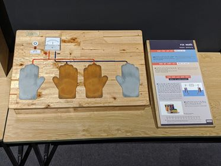

Pin người
=========

Dựa vào tính axit của mồ hôi, cơ thể con người có thể đóng vai trò chất điện ly trong một pin điện hoá. Bằng cách đặt hai bàn tay lên hai tấm kim loại đóng vai trò hai điện cực, người chơi sẽ tạo ra dòng điện đi qua Vôn kế và làm xoay kim trên Vôn kế.

BẠN CẦN LÀM GÌ?

- Hãy đặt bàn tay lên hai tấm nhôm và đồng ở bên trái, chú ý giá trị hiển thị trên Vôn kế. Hãy chuyển sang hai tấm bên phải, quan sát xem Vôn kế có gì thay đổi?

BẠN SẼ THẤY GÌ?

- Khi đặt bàn tay lên 2 tấm kim loại, một hiệu điện thế sẽ hình thành giữa hai tấm kim loại và làm kim Vôn kế di chuyển. Khi chuyển sang hai tấm bên phải, kim Vôn kế chỉ cùng giá trị nhưng khác dấu.

TẠI SAO LẠI NHƯ THẾ?

- Khi 2 tấm nhôm và đồng cùng tiếp xúc với 1 dung dịch dẫn điện (ví dụ như nước muối), 1 phản ứng nhận electron diễn ra ở tấm đồng và ở tấm nhôm diễn ra phản ứng nhường electron. Do đó, electron sẽ di chuyển từ tấm nhôm sang tấm đồng nhờ dây dẫn nối giữa hai tấm, từ đó làm xuất hiện dòng điện bên trong dây. Đây là cơ chế hoạt động của pin điện hóa đơn giản. Các cục pin chúng ta hay dùng hoạt động tương tự như vậy.
- Khi đặt hai bàn tay lên hai tấm đồng và nhôm trong trò chơi này, cơ thể của bạn đóng vai trò là dung dịch dẫn điện.

THÔNG TIN THÊM:

- Chỉ cần  thí nghiệm đơn giản có thể tạo ra dòng điện: 2 kim loại khác nhau (ví dụ Al - Cu, Fe- Cu..) nhúng vào dung dịch dẫn điện (nước muối, chanh..).
- Ai đã tìm ra pin điện? (http://danviet.vn/dong-tay-kim-co/nha-bac-hoc-alessandro-volta-cha-de-cua-pin-dien-1014152.html)
- Cấu tạo pin thường có 3 phần chính :

  + Cực dương (Anode)
  + Cực âm (Cathode)
  + Chất điện phân (Electrolytes)
  + Cực dương anode là nơi tạo ra các electron cho mạch ngoài của pin được kết nối. Khi pin được lắp ráp vào một thiết bị, electron sẽ bắt đầu di chuyển từ cực dương đến cực âm từ đó cung cấp năng lượng cho mạch mà nó được kết nối.

- Mặc dù pin có thể được phân chia tùy thuộc vào kích thước, thành phần, hình thức và chức năng của chúng, nhưng nhìn chung, chúng được phân loại thành các loại sau:

  + Pin khô
  + Pin sạc lại được (https://khbvptr.vn/cac-loai-pin/)

- Ứng dụng của pin điện hóa: pin cac-bon kẽm (pin con ó, pin con thỏ), pin kiềm, pin Li-Ion (pin điện thoại),... (https://mpc247.com/vat-li-kham-pha/857/pin-dien-hoa-nguyen-ly-hoat-dong-cac-loai-pin-dien-hoa.html)
- So sánh hoạt động của pin và acquy (pin sạc)?

  + Giống nhau:

    * Đều hoạt động giống như 1 pin điện hóa.
    * Chuyển đổi năng lượng hóa học thành năng lượng điện.

  + Khác nhau:

    * Pin: Phản ứng hóa học 1 chiều. Khi kim loại ở điện cực âm bị oxi hóa hết thì viên bi cũng sẽ cạn kiệt năng lượng và không sử dụng được nữa.
    * Acquy (pin sạc): phản ứng hóa học thuận nghịch:  tích trữ năng lượng lúc nạp điện và giải phóng năng lượng này khi phát điện.
