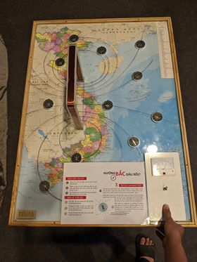

Đường sức từ
============

  Hình thực tế ©ExploraScience

Thí nghiệm này dùng một nam châm điện lớn và chính các mũi kim la bàn để vẽ nên đường sức từ. Việc làm quay nam châm cho thấy vai trò của từ trường trong việc chuyển hoá giữa điện năng và cơ năng.

Bạn cần làm gì?
---------------

Quan sát vị trí ban đầu của các kim la bàn trên bản đồ. Nhấn và giữ nút xanh để dòng điện đi qua cuộn dây đồng, quan sát sự thay đổi hướng của kim la bàn. Gạt công tắc bên phải để đổi chiều dòng điện, tiếp tục quan sát sự thay đổi.

Bạn sẽ thấy gì?
---------------

Ban đầu, các kim la bàn trên bản đồ đều chỉ đúng hướng bắc. Nhưng khi nhấn và giữ nút xanh, các kim la bàn bị lệch khỏi hướng ban đầu với độ lệch khác nhau. Khi gạt công tác bên phải, kim la bàn đổi sang chiều ngược lại.

Tại sao lại như thế?
--------------------

- Trái đất như một thanh nam châm khổng lồ, có cực từ gần trùng với cực Bắc và cực Nam địa lý. Kim la bàn là những thanh nam châm nhỏ, do đó, sẽ bị hút và xoay theo hướng Bắc – Nam.

- Dòng điện chạy qua cuộn dây dẫn cũng tạo thành một từ trường quanh dây. Từ trường này sẽ làm lệch hướng các kim la bàn ở gần nó. Khi đổi chiều dòng điện, từ trường cũng đổi chiều và làm la bàn lệch theo hướng khác.

- Hình biểu thị cường độ và hướng từ trường được gọi là từ phổ, các đường cong xác định hướng của từ trường trên từ phổ gọi là các đường sức từ. Kim la bàn sẽ xoay theo hướng của các đường sức từ này.

Thông tin thêm
--------------

- Vào năm 1600, nhà vật lý người Anh William Gilbert đã đưa ra giả thuyết Trái Đất là một nam châm khổng lồ. Ông đã làm một quả cầu lớn bằng sắt nhiễm từ, gọi nó là "Trái Đất tí hon" và đặt các từ cực của nó ở các địa cực. Đưa la bàn lại gần Trái Đất tí hon ông thấy ngoài hai cực, còn ở mọi điểm trên quả cầu, kim la bàn đều chỉ hướng Nam Bắc. Hiện nay vẫn chưa có sự giải thích chi tiết và thỏa đáng về nguồn gốc từ tính của Trái Đất. (SGK Vật lý 9, trang 60)

- Không gian xung quanh nam châm, xung quanh dòng điện tồn tại một từ trường. Nam châm hoặc dòng điện đều có khả năng tác dụng lực từ lên nam châm đặt gần nó. Người ta dùng kim nam châm (gọi là nam châm thử) để nhận biết từ trường.(SGK Vật lý 9, trang 62)

- Từ phổ là hình ảnh cụ thể về các đường sức từ. Có thể thu được từ phổ bằng cách rắc mạt sắt lên tấm nhựa đặt trong từ trường và gõ nhẹ. Các đường sức từ có chiều nhất định. Ở bên ngoài thanh nam châm, chúng là những đường cong đi ra từ cực Bắc, đi vào cực Nam của nam châm. (SGK Vật lý 9, trang 64)

- Nắm bàn tay phải, rồi đặt sao cho bốn ngón tay hướng theo chiều dòng điện chạy qua các vòng dây thì ngón tay cái choãi ra chỉ chiều của đường sức từ trong lòng ống dây. (Quy tắc nắm tay phải)

- Ứng dụng của nam châm:

  1. Chúng được sử dụng để xây dựng các động cơ điện và máy phát điện mà chuyển đổi năng lượng điện thành năng lượng cơ học và ngược lại.

  2. Chúng cũng được sử dụng trong các loa nghe mà có thể chuyển đổi năng lượng điện thành năng lượng âm.

  3. Chúng được sử dụng trong các chuông điện.

  4. Chúng được sử dụng trong các con tàu chạy bằng lực từ.

  5. Chúng cũng được sử dụng để phân loại các chất từ ​​tính  và phi từ tính từ các đống phế liệu.

  6. Chúng được sử dụng trong màn hình TV, màn hình máy tính, điện thoại và máy ghi âm.

  7. Chúng được sử dụng bởi các nhà máy cung cấp bánh kẹo hoặc đồuống lạnh để tách nắp kim loại từ các lô hàng.

  8. Chúng được sử dụng trong các cần cẩu.

  9. Chúng được sử dụng trong tủ lạnh để giữ cho cánh cửa đóng kín.

  10. Việc sử dụng quan trọng nhất của nam châm là la bàn từ tính được sử dụng để tìm phương hướng địa lý.

  (https://namchamtoancau.com/blog/10-cong-dung-pho-bien-cua-nam-cham.html)
