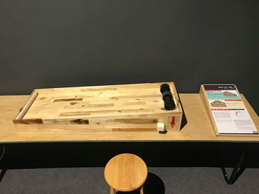

Mô-men quán tính
================

  Hình thực tế ©ExploraScience

Đà lăn của các bánh xe có cùng kích cỡ và cùng khối lượng phụ thuộc vào moment quán tính, có thể tính toán được từ cách phân bố khối lượng gần hay xa trục quay của từng bánh xe. Ở đây, thông qua việc so sánh sự lăn của ba bánh xe trên một mặt phẳng nghiêng, khách tham quan sẽ hiểu hơn về moment quán tính.

.. warning:: Cần biên tập lại: thống nhất thuật ngữ và cách viết thuật ngữ.

Bạn cần làm gì?
---------------

Đặt 3 bánh xe có cùng đường kính và khối lượng lên một đầu mặt phẳng nghiêng. Bạn thử đoán xem bánh xe nào về đích sớm nhất ? Sau đó bạn hãy thả cho 3 bánh xe lăn xuống cùng lúc và kiểm tra dự đoán của mình.

Bạn sẽ thấy gì?
---------------

Bánh xe số 1, có khối lượng tập trung gần trục quay nhất, sẽ về đích sớm nhất.

Tại sao lại như vậy?
--------------------

- Hãy xét riêng chuyển động quay quanh trục của mỗi bánh xe. Để quay được 1 vòng thì 1 điểm nằm xa trục sẽ phải đi quãng đường dài hơn 1 điểm nằm gần trục bánh xe. Do đó, dưới tác dụng của cùng 1 lực hút của Trái đất, bánh xe số 3 với nhiều vật chất nằm xa trục hơn, sẽ mất nhiều thời gian để quay được 1 vòng hơn bánh xe số 1. Cuối cùng, bánh xe số 1 sẽ giành phần thắng.

- Nếu tính chất vật lý đặc trưng cho việc tăng tốc chuyển động thẳng của một vật là khối lượng vật đó (khối lượng càng lớn thì càng khó tăng tốc), thì tính chất đặc trưng cho việc tăng tốc chuyển động quay gọi là mô-men quán tính. Mô-men quán tính của 1 vật so với 1 trục quay càng lớn nếu khối lượng của vật đó phân bố càng xa trục quay. Bánh xe có momen quán tính càng lớn thì có quán tính càng lớn nên chuyển động càng chậm.

Thông tin thêm
--------------

- Ứng dụng của momen quán tính trong đời sống: Bánh xe dùng trong xe đua nhỏ hơn bánh xe ô tô thông thường để xe đua có momen quán tính nhỏ hơn, điều chỉnh tăng tốc và giảm tốc độ dễ dàng hơn.

- Có thể lấy 1 hình ảnh trực quan để minh họa: Buộc 1 sợi dây vào 1 vật tròn và quay tròn. Dùng sợi dây ngắn thì sẽ quay vật dễ dàng hơn khi dùng sợi dây dài.
