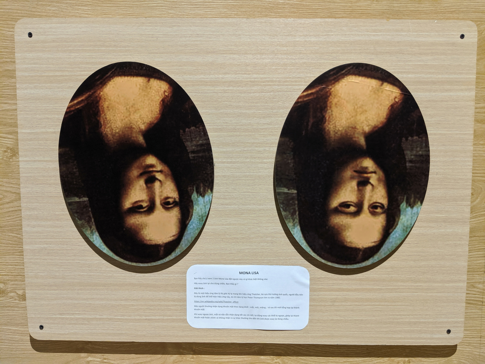

Tìm điểm khác biệt
==================

Hai bức hình Mona Lisa khác nhau khá nhiều được trình bày trong trạng thái quay ngược. Rất khó để nhận ra sự khác biệt, nhưng khi người chơi xoay xuôi chiều hai bức hình thì sự khác biệt trở nên rõ ràng. Đó là do khi quay xuôi hình não bộ có thể dùng những khái niệm có sẵn về khuôn mặt để làm mốc quy chiếu.

- Đây là một hiệu ứng tâm lý thị giác kỳ lạ mang tên "Ảo giác Thatcher" hay “hiệu ứng Thatcher”. Hiệu ứng này được Peter Thompson - một nhà khoa học nhận thức người Anh - phát hiện vào năm 1980. Bức hình đầu tiên ông tạo nên ảo giác này là hình chụp của Margaret Thatcher - thủ tướng Anh thời bấy giờ.
- Não người thường nhận dạng khuôn mặt theo dạng khối: mắt, mũi, miệng… rồi sau đó mới tổng hợp lại thành khuôn mặt. Khi xoay ngược ảnh, mắt và não vẫn nhận dạng tốt các chi tiết, tự động xoay các khối bị ngược và ghép lại thành khuôn mặt hoàn chỉnh mà không nhận ra sự khác thường cho đến khi xoay lại khuôn mặt đúng chiều.
- Điều thú vị là ngay cả khi chúng ta đã biết về hiệu ứng này rõ mười mươi đi nữa thì não bộ vẫn rất "tự tin" đến nỗi khi lướt qua 2 bức hình, chúng ta vẫn sẽ cảm thấy chúng chả có gì khác nhau cả.

Ứng dụng trong thực tế:

- Biết được việc bộ não con người nhận diện một khuôn mặt bằng cách ghi nhớ đặc điểm các bộ phận riêng lẻ: mắt, mũi, miệng… rồi từ đó mới ghép chúng lại với nhau, các hoạ sỹ có thể thể hiện các bức ảnh vẽ người của mình chân thực, hiệu quả hơn; bên cạnh đó, công tác nhận diện người trong việc điều tra phá án cũng được trở nên thuận lợi hơn.
- Hỗ trợ điều trị bệnh nhân của hội chứng tự kỷ và hội chứng rối loạn nhận diện khuôn mặt. (https://en.wikipedia.org/wiki/Thatcher_effect)
