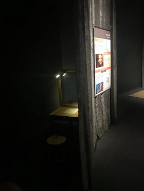

Gương bán phản xạ
=================

Thí nghiệm này cho thấy đặc tính phản xạ và truyền qua của tia sáng luôn tồn tại đồng thời ở đa phần các tấm kính, và gợi mở về các khả năng ứng dụng trong cuộc sống.

BẠN CẦN LÀM GÌ?

Hai người ngồi hai bên gương. Một trong hai người cố gắng chỉnh công tắc để thấy hai khuôn mặt chồng lên nhau trong gương.

BẠN SẼ THẤY GÌ?

Khi xoay công tắc, một đèn sẽ tối đi và đèn kia sáng lên. Bên sáng hơn sẽ gần như chỉ nhìn thấy hình ảnh phản chiếu của mình mà không nhìn thấy bên kia. Nếu hai bên sáng đều nhau, hình ảnh của hai người sẽ chồng lên nhau.

TẠI SAO LẠI NHƯ VẬY?

Kính thủy tinh thông thường cho phép hầu hết ánh sáng đi qua và chỉ phản xạ lại một phần nhỏ. Ở đây, tấm kính đã được dán thêm một lớp phim đặc biệt để tăng khả năng phản xạ. Hãy thử tìm các ứng dụng thực tế của sự kết hợp này trong cuộc sống nhé!

THÔNG TIN THÊM:

- Gương bán phản xạ được cấp bằng sáng chế vào năm 1903.
- Liên tưởng thực tế: Ban đêm, bạn đang ở trong 1 căn phòng sáng, bạn không thể nhìn thấy người ở bên ngoài căn nhà nhưng những người bên ngoài sẽ nhìn thấy bạn.Cửa kính thường cũng có tác dụng như vậy.
- So sánh các loại gương:

  + Gương soi: 1 tấm thủy tinh mỏng, tráng 1 lớp kim loại mỏng (nhôm hoặc bạc) ở phía sau có tác dụng phản xạ toàn bộ ánh sáng chiếu tới.
  + Gương bán phản xạ: Cấu tạo giống như gương soi nhưng lớp vật liệu phản xạ mỏng hơn nên phản chiếu ánh sáng ít hơn (chỉ có 50% ánh sáng bị phản xạ lại, còn 50% ánh sáng sẽ đi qua gương, giống như ánh sáng đi qua kính)
  + Cửa kính: Không có lớp vật liệu phản xạ phía sau, ánh sáng thường truyền qua khoảng 95-96% và phản xạ lại khoảng 5-6%

- Ứng dụng của loại gương này trong cuộc sống? Dùng trong phòng thẩm tra tội phạm, tạo hiệu ứng sân khấu,...Lớp phủ bán phản xạ cửa kính giúp giảm bớt ánh sáng và nhiệt độ phòng, nhưng vẫn có thể nhìn ra bên ngoài dễ dàng.
- Video tham khảo: (https://www.youtube.com/watch?v=VvqbjUtt3mM)
