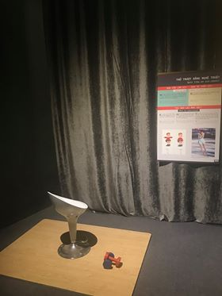

Ghế xoay
========

  Hình thực tế ©ExploraScience

Bằng cách tận dụng định luật bảo toàn động lượng góc, một người ngồi trên ghế xoay có thể thay đổi tốc độ xoay mà không cần lực tác động từ bên ngoài, bằng cách thay đổi tư thế, tức moment quán tính của chính mình. Qua đó hiểu hơn cách các vận động viên trượt băng nghệ thuật đạt được tốc độ quay ấn tượng.

.. warning:: Cần biên tập lại: thống nhất thuật ngữ và cách viết thuật ngữ.

Bạn cần làm gì?
---------------

- Hãy ngồi lên ghế và dang tay ra. Nhờ một người bạn xoay ghế từ từ. Sau một lúc, hãy thu tay lại sát người và giữ nguyên tư thế. Bạn có thể lặp lại việc dang tay ra và thu tay vào nhiều lần.

Bạn sẽ thấy gì?
---------------

- Khi thu tay lại, chiếc ghế sẽ quay nhanh hơn mà không hề có tác động từ bên ngoài.

Tại sao lại như vậy?
--------------------

- Khi dang tay thì khối lượng của bạn sẽ phân bố xa trục quay hơn so với khi bạn thu tay.

- Như vậy, khi dang tay bạn có mô-men quán tính lớn hơn. (Xem thí nghiệm Nhanh hay chậm 1 ở trong căn phòng này).

- Theo định luật bảo toàn động lượng góc, khi thu tay lại vận tốc quay của bạn sẽ tăng lên.

Thông tin thêm
--------------

- Tính chất chống lại sự thay đổi trạng thái chuyển động của vật trong chuyển động thẳng (tính ì của vật) gọi là quán tính. Đại lượng đặc trưng cho khả năng chống lại sự thay đổi trạng thái chuyển động của vật trong chuyển động quay gọi là momen quán tính.

- Ứng dụng momen động lượng trong thực tế:

	- Các vũ công trượt băng nghệ thuật thu và dang tay để có thể xoay nhanh và đẹp mắt hơn.

 	- Bằng cách co tay và chân ở tư thế gập người, VĐV nhảy cầu có thể giảm rất nhiều mô men quán tính của mình đối với chính trục quay đi qua khối tâm của họ và nhờ đó tăng đáng kể được tốc độ góc của mình. Bằng cách chuyển từ tư thế gập người sang tư thế duỗi thẳng người ở cuối quá trình nhảy, VĐV làm tăng mô men quán tính, nhờ đó làm giảm tốc độ quay của mình, do đó có thể lao xuống nước làm nước bắn ít.

Nâng cao
--------

Phần này dành cho học sinh cấp 3 và Đại học.

Công thức momen quán tính:

.. math::

	I=mr^2

trong đó:

	| I: Momen quán tính.
	| m: Khối lượng chất điểm của vật rắn.
	| r: Khoảng cách từ chất điểm đến trục quay.

Độ lớn của momen quán tính phụ thuộc vào khối lượng của vật và sự phân bố khối lượng so với trục quay.

Công thức momen động lượng:

.. math::

	L= I\omega

trong đó:

	| L: Momen động lượng.
	| I: Momen quán tính.
	| 𝝎: Tốc độ góc.

Định luật bảo toàn momen động lượng:

.. math::

	I_1\omega_1 = I_2\omega_2

trong đó:

	| :math:`I_1\omega_1` là momen động lượng của người khi dang tay.
	| :math:`I_2\omega_2` là momen động lượng của người khi thu tay lại.

Khi dang tay, bạn có momen quán tính lớn :math:`I_1 > I_2` nên :math:`\omega_1 < \omega_2` do đó khi dang tay bạn sẽ xoay chậm hơn khi thu tay lại.
