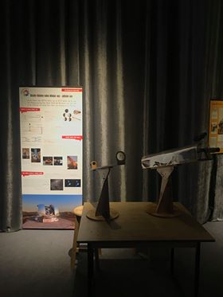

Kính thiên văn
==============

Tìm hiểu nguyên lý kính thiên văn: Người chơi sẽ nhìn thấy hình ảnh to, rõ và ngược chiều xuất hiện trong ống kính trong khi mắt thường không thể nhìn thấy rõ các chi tiết của hình.

Kính thiên văn (KTV) khúc xạ và KTV phản xạ là các hệ thống quang học được thiết kế để quan sát các vật ở xa. Chúng mở rộng tầm nhìn của chúng ta về Vũ trụ.

KHÚC XẠ HAY PHẢN XẠ

KTV khúc xạ:

- KTV khúc xạ được cấu thành từ ít nhất 2 thấu kính, được ra đời từ đầu thế kỉ 17 và cho đến nay chúng ta vẫn chưa biết ai là người đã sáng tạo ra nó. Thấu kính thứ nhất, gọi là vật kính, có đường kính lớn để thu thập ánh sáng. Thấu kính thứ hai, gọi là thị kính, có tác dụng phóng đại ảnh của thấu kính thứ nhất, giống như một kính lúp.
- KTV kiểu Kepler là sự kết hợp của hai thấu kính hội tụ. Ảnh nhìn thấy bị đảo ngược nhưng đó không phải là vấn đề trong quan sát thiên văn. Đây là loại KTV khúc xạ phổ biến nhất.
- Khoảng 1609, Galileo là một trong những người đầu tiên quan sát bầu trời bằng KTV khúc xạ do ông tự chế. Ông đã khám phá bề mặt lồi lõm của Mặt trăng, các pha của Sao Kim, các vệ tinh của Sao Mộc… Trong vòng không đầy 5 năm, những quan sát từ KTV khúc xạ đã tạo tiền đề cho việc thay đổi hoàn toàn thế giới quan của chúng ta.

KTV phản xạ:

- Trong một KTV phản xạ, vật kính là một gương cầu lõm. Chiếc gương này sẽ phản xạ các tia sáng đi đến theo chiều ngược lại, do đó chúng phải được làm lệch hướng để có thể quan sát được. Newton đã tìm ra sự kết hợp dễ dàng nhất bằng cách đặt thị kính vuông góc với chùm tia tới. KTV kiểu Cassegrain thì lại đưa các tia sáng qua một lỗ nhỏ nằm ở tâm của tấm gương đầu tiên.
- KTV kiểu Newton, với một gương phẳng thứ cấp có tác dụng phản chiếu các tia sáng một góc 90o từ vật kính đến thị kính.

LUÔN LUÔN LỚN HƠN

- Tăng kích thước của KTV khúc xạ và KTV phản xạ có 2 tác dụng: cải thiện độ nhạy sáng để quan sát được các thiên thể ở xa với ánh sáng yếu và đạt được độ phân giải góc để phân biệt được các thiên thể ở gần nhau.
- Tuy nhiên việc tăng kích thước các thấu kính đặt ra nhiều vấn đề, một phần trong số đó đã được giải quyết vào thế kỉ 19: khi độ dày tăng, độ trong suốt của thấu kính cũng phải tăng theo; sắc sai cũng cần phải được hiệu chỉnh bằng một hệ kính tiêu sắc; cuối cùng, thấu kính được giữ bởi các viền, cuối cùng, sự biến dạng của thấu kính do trọng lượng lớn trở nên rất dễ thấy.
- Cho đến thế kỉ thứ 19, các gương phản xạ được làm từ kim loại đánh bóng, thường là đồng, do đó chỉ phản xạ được tối đa 33% ánh sáng. Từ 1851, các gương được sản xuất bằng cách tráng một lớp bạc hoặc nhôm mỏng lên một tấm thủy tinh đã được đánh bóng. Nhờ đó, cấu trúc kính trở nên nhẹ hơn, cứng hơn, phản xạ tốt hơn và ít bị ảnh hưởng bởi thay đổi nhiệt độ hơn.
- Sắc sai của một thấu kính: các tia sáng hội tụ tại các điểm khác nhau tùy vào màu của chúng. Các tiêu điểm đó có thể được nhóm lại bằng cách thêm một thấu kính phân kì với chiết xuất khác và có tiêu cự lớn hơn. Chúng ta thu được một hệ kính tiêu sắc, nhưng sẽ nặng và khó chế tạo hơn vì phải đánh bóng 4 mặt.
- Nhiều trở ngại về mặt kĩ thuật đã dẫn đến việc từ bỏ các KTV khúc xạ để sử dụng các kính thiên văn phản xạ. KTVtại đài quan sát Yerkes (1897) là kính khúc xạ lớn nhất từng được chế tạo, có đường kính lên đến 102cm.
- KTV Hooker (1917), đặt tại đỉnh Wilson có đường kính gương lên tới 2,5m. Kính này được Edwin Hubble sử dụng để chỉ ra rằng một số tinh vân thật ra là những thiên hà, và đề cập đến sự giãn nở của vũ trụ.
- Sản xuất các gương sơ cấp của hệ kính VLT (Very Large Telescope): phải mất vài tuần để làm nguội khối thủy tinh, sau đó quá trình đánh bóng phải chính xác hơn việc đánh bóng một thấu kính, nhưng chỉ có một mặt cần được thực hiện.
- Đây là KTV kiểu Foucault lớn nhất, có đường kính 80cm, một trong những chiếc kính đầu tiên ở Pháp sử dụng gương thủy tinh tráng kim loại. Nó được sử dụng đến năm 1950 tại Đài thiên văn Marseille.

ĐỘ NHẠY SÁNG VÀ PHÂN GIẢI

- Sự ra đời của kĩ thuật nhiếp ảnh vào thế kỉ 19 đã cho phép cải thiện độ nhạy sáng bằng cách phơi sáng trong một thời gian dài. Từ những năm 1970, các cảm biến CCD nhạy hơn đã được sử dụng. Ngoài ra, các cảm biến này cho phép định lượng một cách khách quan ánh sáng nhận được từ các thiên thể.
- Sự nhiễu loạn của khí quyển Trái Đất làm giảm độ phân giải của các KTV. Kể cả trong điều kiện thời tiết tốt nhất, độ phân giải của kính đã đạt cực đại với độ mở chỉ bằng 20cm! KTV Hubble đặt phía trên bầu khí quyển đã giải quyết được vấn đề này. Đối với các KTV mặt đất, có một giải pháp được gọi là quang chỉnh: gương thứ cấp được cho biến dạng 200 đến 1000 lần mỗi giây để hiệu chỉnh các nhiễu loạn của bầu khí quyển.
- Công nghệ quang chỉnh được giới thiệu vào những năm 1990. Trong hệ kính VLT ở Chi-lê, chùm laser chiếu đến độ cao 90km tạo ra một “ngôi sao nhân tạo”, được sử dụng để đo liên tục sự nhiễu loạn của khí quyển.

THÔNG TIN THÊM:

- Vật kính : Là 1 thấu kính hội tụ hay 1 gương cầu lõm. Nó cho ảnh thực (ảnh có thể hứng trên màn) tại tiêu điểm. Gợi ý việc dùng kính lúp hay gương lõm hội tụ tia sáng mặt trời để đốt cháy giấy : đó chính là ảnh mặt trời qua thấu kính hay gương lõm.
- Thị kính : Cũng là 1 thấu kính hội tụ để nhìn ảnh thực đó  dưới góc to hơn , như bạn dùng kính lúp để phóng to các vật nhỏ vậy.
- Khi kết hợp vật kính và thị kính ta có được 1 kính thiên văn để nhìn rõ các vật ở rất xa. (“Kính thiên văn” SGK VL11)
- Kính thiên văn khúc  xạ : phát triển từ ống nhòm đơn giản của Hans Lippershey (1608) chỉ gồm 2 thấu kính : Vật kính hội tụ tạo ảnh và vật kính là thấu kính phân kỳ.

  + Cải tiến, hiện vẫn đang dùng, là xử dụng thị kính hội tụ, cho trường nhìn rộng hơn của nhà thiên văn nổi tiếng, với 3 định luật mang tên mình, Johann Kepler.
  + Kính khúc xạ khá nhỏ gọn và dễ xử dụng (do hướng nhìn dọc theo ống kính).

- Kính thiên văn phản xạ : do nhà Vật lý thiên tài người Anh Issac Newton phát minh vào năm 1668. Khác với các kính thiên văn kiểu khúc xạ trước đó, ông dùng vật kính gương cầu lõm để tạo ảnh thực, để tránh đầu người quan sát và thị kính che khuất ánh sáng đến gương, ông dùng 1 gương phẳng để phản xạ ảnh lệch 90o ra khỏi thân ống kính. (xem ảnh trên poster và chỉ dẫn trên mô hình).

  + Ưu điểm của kính phản xạ là Gương phản xạ có thể chế tạo rất to (so với thấu kính của kính khúc xạ) mà vẫn giữ được chất lượng tốt . Do đó các kính thiên văn lớn sau này đều là kính phản xạ.

- Hình ảnh bạn nhìn thấy trong ống kính là ảnh của 2 nhà phát minh này. Chúng bị lộn ngược là vật kính đều tạo ảnh thật, ngược chiều với vật. Có thể dễ dàng đảo ngược ảnh để dễ nhìn hơn bằng cách dùng thêm ống (hệ quang học) đảo ảnh, nhưng trong quan sát thiên văn, điều này là không cần thiết (không có “trên” “dưới” trong vũ trụ) và trở thành điểm khác biệt của kính thiên văn so với ống nhòm và kính viễn vọng (có ảnh cùng chiều với vật).
- Các chỉ tiêu quan trọng của KTV :

  + Độ bội giác (độ phóng đại) G = f1 /f2: vật kính tiêu cự càng dài, thị kính tiêu cự càng ngắn thì độ bội giác càng lớn: cho ảnh to hơn
  + Khả năng thu sáng (so với mắt người): D^2 / d^2 với D và d lần lượt là đường kính vật kính và đường kính con ngươi mắt. Kính có vật kính to thì thu sáng càng tốt, có thể thấy được các vật thể tối hơn.
  + Độ phân giải là khả năng phân biệt các chi tiết nhỏ trên bề mặt thiên thể hay tách bạch các thiên thể gần nhau. Kính càng to nhìn càng rõ.

- Kính thiên văn quang học lớn nhất thế giới  hiện nay là kính Gran Telescopio Canarias có vật kính gồm nhiều gương ghép lại với nhau, có đường kính tổng lên đến 10.4m đặt tại đài thiên văn Roque de los Muchachos Observatory trên quần đảo Canaries, Tây ban nha.
- Bầu khí quyển trái đất là một trở ngại lớn cho việc quan sát thiên văn : mây, bụi, gió….và hầu như không thể quan sát được các vùng sóng gamma, tia X, hồng ngoại nên các nhà TV đã quyết định đưa kính TV của mình vào không gian để có điều kiện quan sát tốt nhất vào mọi thời điểm : Nổi tiếng nhất có thể kể đến Kính thiên văn không gian Hubble và sau đó là kính James Webb (dự kiến phóng lên không gian trong năm 2021).
- Tại sao các nhà KH, bất chấp chi phí và công sức để chế tạo và sử dụng các kính TV ngày càng lớn hơn ? Họ đang tìm cách “nhìn” xa hơn vào vũ trụ cả về không gian lẫn thời gian : Vận tốc ánh sáng là hữu hạn (300,000 km/s),  nhìn xa hơn vào vũ trụ, nghĩa là ta đang nhìn vào quá khứ vài triệu năm đến hàng tỉ năm trước đây, khi các tia sáng rời khỏi các thiên thể  và mang các thông tin về nó vào thời điểm đó. Việc tìm hiểu cấu tạo, bản chất của các thiên thể là để hiểu rõ hơn về chính trái đất mà ta đang sống.
