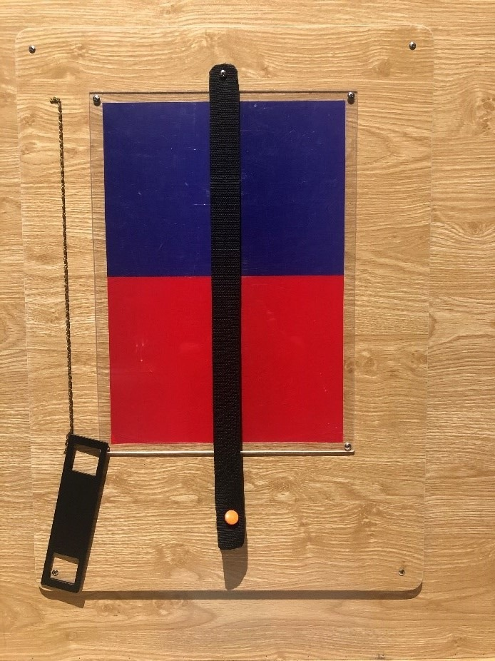

N sắc thái màu
==============

Người chơi sẽ phát hiện hai nửa của bức hình trước mặt không có cùng màu sắc khi nhấc dải phân cách ra. Khả năng nhận biết cường độ màu rất kém của mắt: Nhìn vào bảng màu cảm giác như chỉ có 2 màu (khi dùng dây ngăn) nhưng khi lấy dây ngăn ra thì lại là 4 màu.

BẠN CẦN LÀM GÌ?

- Bạn nhìn thấy bao nhiêu màu trên tấm bảng? Trừ màu nâu của dải băng thì bạn nhìn thấy 2 màu đỏ và xanh phải không? Hãy kéo dải băng sang một bên để kiểm tra nhé!

BẠN SẼ THẤY GÌ?

- Ban đầu, màu sắc của hai bên dải băng dường như giống hệt nhau. Tuy nhiên, khi kéo dải băng lệch sang một bên, bạn sẽ thấy sự khác biệt rõ rệt về độ đậm nhạt giữa hai bên.

TẠI SAO LẠI NHƯ VẬY?

- Mắt của bạn được thiết kế để phân biệt rất tốt các màu sắc, kể cả khi chúng gần giống nhau. Tuy nhiên, khi những màu sắc đó không đặt cạnh nhau thì não của con người sẽ dừng phân biệt chúng, dường như để tiết kiệm năng lượng.

THÔNG TIN THÊM:

- Ứng dụng trong đời sống: Khi muốn mặc một bộ quần áo tông - xuyệt - tông nhưng màu áo và quần lại không hoàn toàn giống nhau, ta có thể dùng một chiếc thắt lưng (dây nịt) để đánh lừa thị giác của người nhìn.
