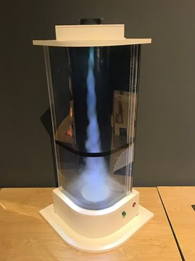

Lốc xoáy
========

Mô phỏng lốc xoáy trong tự nhiên và ảnh mây vệ tinh của các cơn bão, minh họa sự hình thành bão, lốc và những gì xảy ra bên trong cơn bão.

BẠN CẦN LÀM GÌ?

Ấn nút đỏ và xem chuyện gì xảy ra. Bạn có thể ấn nút xanh để nhìn hiện tượng xảy ra theo một cách khác.

BẠN SẼ THẤY GÌ?

Bạn sẽ nhìn thấy một cột khói hình xoắn ốc bên trong ống sau khi nhấn nút đỏ. Khi nhấn nút xanh, một đèn được bật lên cho phép bạn nhìn thấy sự chuyển động của cột khói theo chiều ngang.

TẠI SAO LẠI NHƯ VẬY?

Khi ấn nút đỏ, nước được làm bay hơi phía dưới, hình thành một làn sương. Làn sương đó bốc lên thành cột do có quạt hút phía trên. Đồng thời, cột hơi nước có chuyển động xoáy do không khí tràn vào trong ống thông qua khe hở hai bên ống.

Quạt hút minh họa một áp thấp trong tự nhiên, khi một vùng không khí có áp suất thấp hơn bình thường kéo các khối không khí xung quanh lại gần. Nếu các khối không khí này nóng, ẩm thì khi bốc lên cao hơi nước sẽ ngưng tụ, tạo nên mây, mưa. Do Trái đất tự quay, hướng gió quanh tâm áp thấp sẽ có một chiều nhất định, tạo thành các vòng xoáy. Khi gặp điều kiện thuận lợi, áp thấp nhiệt đới sẽ phát triển thành bão nhiệt đới.

THÔNG TIN THÊM:

- Nguyên lí hoạt động: Bộ tạo sương siêu âm phát ra sóng âm làm loa rung. Các phân tử nước nằm trên mặt loa sẽ dao động mạnh sinh ra nhiệt và bốc ra khỏi khối nước hình thành sương, quạt thổi sương bay lên. Không khí nóng, giãn nở, nhẹ hơn nên bay lên, tạo khoảng trống bên dưới. Quạt tạo vùng áp suất thấp bên trong nên không khí bên ngoài qua cửa thông gió tràn vào khoảng trống. Vì 2 cửa thông gió bố trí lệch tâm nên không khí tràn vào khoảng trống sẽ bị đổi hướng nên cột hơi nước sẽ chuyển động xoáy hình thành lốc xoáy. Đèn laze chiếu qua 1 khe hẹp sẽ quét 1 mặt phẳng và ta sẽ thấy những thứ nằm trên mặt phẳng đó. Đó chính là mặt cắt ngang của lốc xoáy.
- Nguyên nhân dẫn đến lốc xoáy trong tự nhiên và trong mô hình:

  + Trong tự nhiên: Do sự đốt nóng của ánh sáng Mặt trời , không khí gần mặt đất nóng lên, giãn nở nên nhẹ hơn . Khối không khí này sẽ bốc lên cao. Áp suất khí quyển khu vực này sẽ thấp hơn so với xung quanh nên kéo không khí lạnh xung quanh tràn vào. Do Trái đất tự quay, dưới tác dụng của lực Coriolis, các dòng khí đổi hướng nên các khối khí này chuyển động xoáy và hình thành lốc xoáy. (SGK Địa lý lớp 10, Bài 5: Hệ quả chuyển động tự quay của trái đất)
  + Trong mô hình: Quạt hút phía trên tạo vùng áp suất thấp bên trong hút khí lên trên, không khí bên ngoài qua cửa gió tràn vào khoảng trống. Vì 2 cửa gió bố trí lệch tâm, không khí tràn vào sẽ bị đổi hướng nên cột hơi nước sẽ chuyển động xoáy hình thành lốc xoáy. Khi nhấn và giữ nút xanh thì sẽ thấy hình ảnh các cơn bão chụp từ vệ tinh mà ta thường thấy trên báo hoặc các chương trình dự báo thời tiết.

- Thông tin thêm về lực Coriolis:

  + Khi trái đất tự quay, các vật thể chuyển động trên bề mặt trái đất sẽ bị lệch hướng so với hướng ban đầu. Bán cầu Bắc, vật chuyển động bị lệch về bên phải, bán cầu Nam vật chuyển động về bên trái theo hướng chuyển động nên lốc xoáy ở các bán cầu sẽ khác nhau.
  + Ví dụ: theo kinh tuyến, Trái đất quay từ tây sang đông nên khi 1 vật chuyển động từ cực Bắc đến xích đạo (tức là chuyển động từ nơi có vận tốc thấp sang nơi có vận tốc cao) nên  hướng chuyển động lệch về phía bên phải. Khi 1 vật chuyển động từ xích đạo đến cực Bắc (tức là chuyển động từ nơi có vận tốc cao sang nơi có vận tốc thấp) nên  hướng chuyển động lệch về phía bên phải.
  + Lực làm lệch hướng này được Coriolis  nhà toán học, vật lí người Pháp mô tả vào năm 1835 nên ta gọi là lực Coriolis. Lực này tác dụng mạnh đến hướng chuyển động của các khối khí. Do đó các dòng khí đổi hướng nên các khối khí này chuyển động xoáy và hình thành lốc xoáy.

- Thí nghiệm kiểm trứng sự tồn tại lực Coriolis

  + Con lắc Foucault, đặt tên theo nhà vật lý người Pháp Léon Foucault, là một thí nghiệm để chứng tỏ rằng Trái Đất đang tự quay quanh trục của nó; và là một hệ quả của hiệu ứng Coriolis cho chuyển động trong hệ quy chiếu quay.
  + Vào năm 1851, nhà khoa học người Pháp Léon Foucault đã sử dụng một dây thép dài 68 m để treo một quả cầu sắt nặng 31 kg từ mái vòm của nhà thờ Panthéon và tác dụng một lực ban đầu, cho nó lắc đi lắc lại. Để đánh dấu quá trình chuyển động của quả cầu, ông đã cho gắn một kim nhọn vào quả cầu và cho vẽ một vòng tròn trên cát ẩm ở mặt đất phía dưới chuyển động của quả cầu. Quả cầu đã để lại những vệt của đường đi khác nhau sau mỗi chu kỳ chuyển động chậm chạp và quỹ đạo này đã chỉ ra rằng Trái Đất quay tròn xung quanh trục của nó. Tại đường vĩ độ đi qua thành phố Paris, đường chuyển động của con lắc đã thực hiện một vòng quay thuận chiều kim đồng hồ cứ sau 30 giờ. Tại Nam Bán Cầu, đường đi đó ngược chiều kim đồng hồ, và tại xích đạo, nó không quay tròn chút nào. Tại Nam Cực, những nhà khoa học ngày nay đã xác nhận chu kỳ của đường đi của con lắc là 24 giờ.

- Giải thích cơ chế hình thành của các cơn bão: Dưới ảnh hưởng của hiệu ứng Coriolis ở Bắc bán cầu, gió thổi có xu hướng lệch về phía đông. Nước ta nằm ở Bắc bán cầu, tại các vùng biển lực Coriolis làm cho gió bề mặt trong vùng xoáy luôn có chiều ngược với kim đồng hồ.Các cơn bão ở Bắc bán cầu luôn có dạng xoáy ngược chiều kim đồng hồ, còn ở Nam bán cầu thì ngược lại. Bão gây ra do các tâm áp thấp ở ngoài biển tức là có một vùng áp suất thấp, không khí xung quanh sẽ chạy dồn về đó, biến thành gió và biển động. Các mũi tên màu đỏ chỉ thị sự dồn về tâm của không khí. Như trên ta nói các vật thể chuyển động trên Trái Đất ở bán cầu Bắc chịu tác động của lực Coriolis hướng sang bên phải, vậy lực Coriolis tác động lên các phần tử không khí có hướng như mũi tên đen. Chính sự sắp xếp đó buộc không khí vừa chạy vào trong vừa bị kéo sang phải, khiến bão có dạng hình xoáy ngược chiều kim đồng hồ.Bão ở Nam bán cầu sẽ có dạng ngược lại, tức là quay theo chiều kim đồng hồ.
- Tác hại của lốc xoáy?

  + Lốc xoáy (còn gọi là vòi rồng) di chuyển với tốc độ rất nhanh, phá hủy hết tất cả mọi thứ trên đường đi của nó: những chiếc ô tô, những căn nhà.. và cuốn cả con vật, con người trên đường đi.
  + Năm 1925, thảm họa vòi rồng  “Tri - State Tornado” xảy ra ở 3 bang miền Trung Tây nước Mỹ. Đây được xem là 1 trong 10 thảm kịch vòi rồng khủng khiếp nhất trong lịch sử nhân loại. Có 747 người chết, hơn 2200 người bị thương và phá hủy hơn 15000 ngôi nhà.
  + Năm 2017, tại Phú Yên (Việt Nam) xảy ra 1 cơn lốc xoáy là 11 người chết, 10 người mất tích và hàng trăm tàu cá bị hư hại.

- Lốc xoáy xảy ra ở đâu? Lốc xoáy có thể xuất hiện ở mọi châu lục trừ châu Nam Cực, nhưng một vài địa điểm trên thế giới lại thường hay gặp lốc xoáy là các vùng nhiệt đới vì hội đủ 2 điều kiện để tạo nên lốc xoáy và bão là : nhiệt lượng (từ mặt trời) và lực Coriolis mạnh.
- Hướng di chuyển của các cơn bão, áp thấp nhiệt đới ở nước ta:

  + Tại các vùng biển ở Bắc bán cầu như nước ta, do ảnh hưởng của hiệu ứng Coriolis sinh ra do chuyển động tự quay của Trái Đất, gió bề mặt trong vùng xoáy luôn có chiều ngược với chiều kim đồng hồ (như đã nói ở mục 1). Do đó, hầu hết các cơn bão có ảnh hưởng đến vùng biển nước ta đều hình thành từ trung tâm Thái Bình Dương, vượt qua Philipin đi vào biển Đông. Trừ một vài trường hợp đặc biệt, các cơn bão (hoặc áp thấp nhiệt đới) đều có hướng di chuyển chủ đạo là từ phía Đông(Đông Nam - Đông Bắc) sang phía Tây ( Tây Bắc - Tây Nam).
  + Tại một thời điểm nào đó tưởng tượng trãi một đường thẳng đi qua tâm bão theo hướng di chuyển của bão thì đường thẳng ấy sẽ chia vùng bão thành hai nữa, “bên phải (nửa phía bắc, nếu bão di chuyển từ Đông sang Tây) và bên trái (nửa phía Nam). Ở nữa bên phải tốc độ gió mạnh hơn, phạm vi ảnh hưởng của gió mạnh hơn, mưa và sóng biển cũng dữ dội hơn so với nữa bên trái. Do đó, sức tàn phá của cơn bão ở nữa phía Bắc bao giờ cũng mạnh hơn ở nữa kia. Sở dĩ có hiện tượng đó là do ở nửa bên phải, chiều của gió xoáy trùng với chiều di chuyển của bão nên tốc độ gió tổng cộng là lớn hơn. Còn ở nữa bên trái thì ngược lại, tàu thuyền ở nửa bên phải rất dễ bị cuốn vào vùng gần trung tâm là nơi có sức tàn phá của bão. Tương tự như vậy: nếu tàu hỏa chạy theo hướng từ Nam ra Bắc thì đường ray bên phải sẽ bị nghiến rất mạnh. Đường Bắc - Nam cũng như vậy, làn đường Ôtô đi từ Nam ra Bắc thì bánh bên phải sẽ làm đường bị lún nhiều hơn, còn đi từ Bắc vào Nam thì ngược lại. (http://gen.humg.edu.vn/index.php?option=com_content&task=view&id=525&Itemid=259)
