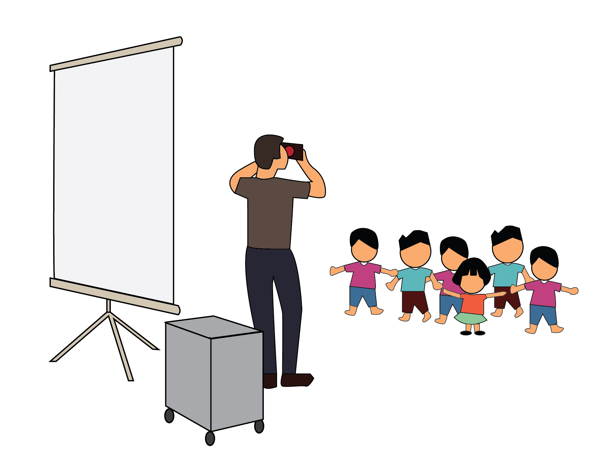
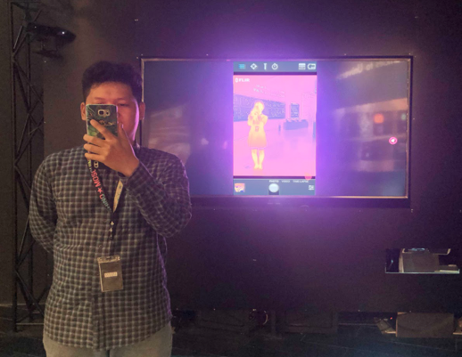
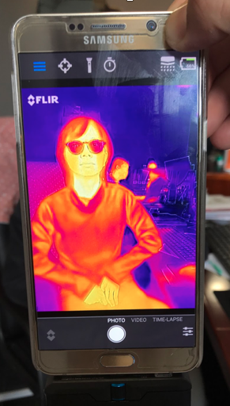

Khám phá dải sóng hồng ngoại
============================

  Hình thiết kế ©ExploraScience

A. Giới thiệu
-------------

Người tham gia sẽ được nhân viên phổ biến khoa học của Trung tâm sắp xếp ngồi trước một màn chiếu lớn. Nhân viên phổ biến khoa học sẽ giới thiệu về ánh sáng nói chung, trong đó có dải sóng hồng ngoại thuộc về phần ánh sáng không nhìn thấy được.

Người tham gia sẽ nhìn thấy trên màn ảnh lớn hình ảnh của người và vật với các màu sắc thể hiện nhiệt độ từ thấp đến cao, kể cả khi người hoặc vật đó nằm trong bóng tối hoặc bị che khuất. Qua đó, các tính chất nâng cao của dải sóng hồng ngoại sẽ trở nên gần gũi, dễ hiểu với công chúng.

  Góc nhìn từ khán giả ©ExploraScience

  
  Góc nhìn từ diễn giả ©ExploraScience

B. Kịch bản cho Show trình diễn
-------------------------------

1. Giới thiệu về “nhiệt”
++++++++++++++++++++++++

-	Các bạn có hay nghe và dùng từ “nhiệt” trong đời sống không?
-	Nhiệt được dùng để làm gì? (nấu ăn….)
-	Nhiệt là 1 dạng năng lượng rất quan trọng đối với cuộc sống này.
-	Hãy thử trả lời câu hỏi: Nếu không có nhiệt thì các bạn có nấu được đồ ăn không, các bạn thích ăn một bát mì ăn liền còn nóng hay đã nguội? Bát mì còn nóng chắc chắn sẽ ngon hơn đúng không?
-	Và chính vì vậy, nhiệt rất quan trọng đối với cuộc sống của chúng ta. Nó giúp chúng ta giữ ấm cơ thể, giúp thức ăn trở nên ngon hơn.

2. “Nhìn thấy nhiệt”
++++++++++++++++++++

-	Trên tay tôi là 1 chiếc cốc màu đen (sử dụng loại cốc đổi màu cảm biến nhiệt). Chiếc cốc này sẽ giúp chúng ta “nhìn thấy nhiệt”, mọi người hãy đoán xem chúng ta sẽ làm như thế nào?
-	Bây giờ, tôi sẽ đổ nước vào trong cốc này xem thử có hiện tượng gì xảy ra không? Đầu tiên, hãy thử với nước lạnh! (Không có hiện tượng gì xảy ra)
-	Tiếp theo, hãy thử với nước nóng xem sao.
-	Như vậy, chiếc cốc đã đổi màu khi chúng ta đổ nước nóng vào. Vậy là chúng ta đã nhìn thấy nhiệt.
-	Nhưng bình thường mọi người làm thế nào để nhìn thấy nhiệt ạ? (Các loại nhiệt kế và hạn chế…)
-	Ngoài ra, tôi còn có ở đây 1 chiếc camera rất đặc biệt. Chiếc camera này cũng sẽ giúp chúng ta có thể “nhìn thấy nhiệt”. Chiếc camera đặc biệt này được gọi là camera nhiệt hay camera hồng ngoại.(Mở camera để nhìn thấy mọi người trên màn hình.)

3. Cơ thể chúng ta toả nhiệt và phát ra tia hồng ngoại
++++++++++++++++++++++++++++++++++++++++++++++++++++++

-	Trước tiên, xin mời 1 bạn xung phong lên đây làm mẫu. (Mời 1 khán giả lên sân khấu/ phía trên.)
-	(Làm quen với khán giả này, giả sử tên A.)... Và bây giờ, bạn sẽ làm mẫu cho tôi nhé, sẽ không có gì khó khăn cả, bạn chỉ việc ngồi trên chiếc ghế đằng kia giúp tôi là được. (Chỉ vào chiếc ghế và chờ bạn khán giả ngồi lên.)
-	Chúng ta đã nhìn thấy bạn A trên màn hình chưa? (Chỉnh camera cho đến khi mọi người đều có thể nhìn thấy A trên màn hình.)
-	Vậy các bạn có để ý rằng trên màn hình có rất nhiều màu sắc không? Hãy đoán xem ý nghĩa của thang màu này là gì? (Dùng cốc nước nóng lạnh, thang màu trên màn hình hoặc in ra giấy để minh hoạ nếu có)
-	Đúng vậy, màu sắc thể hiện mức độ nóng lạnh. Nếu bạn nhìn thấy phần nào có màu trắng sáng thì phần đó nóng, còn phần nào có màu xanh đậm thì phần đó lạnh hơn.
-	Thế bây giờ, chúng ta hãy nhìn lên màn hình và tìm xem những bộ phận nào trên cơ thể bạn A là nóng nhất! (Các bộ phận cơ thể, các phần của khuôn mặt…)
-	Các bạn biết không, những phần nóng nhất của cơ thể chính là những phần toả nhiều nhiệt nhất. (Một số lý giải cho những hành động thường ngày:)
-	Chúng ta sẽ làm gì khi cảm thấy lạnh? Chính xác! Hãy che chắn/giữ ấm cho phần đầu, cổ, tay và chân của mình.
-	Hoặc khi cảm thấy tay mình lạnh, bạn cũng có thể đặt tay mình lên cổ như thế này. (Người dẫn làm mẫu.) Hãy thử xem! Bạn cảm thấy ấm hơn đúng không?!
-	Để kiểm tra xem chúng ta có đang bị sốt không, hãy đặt tay lên phần mặt hoặc cổ của mình để cảm nhận nhiệt độ.
-	Cảm ơn bạn A rất nhiều! Mời bạn đến đây, tôi có 1 món quà tặng bạn. (quay camera về phía khán giả)
-	(A chuẩn bị đi xuống sân khấu.) Khoan A ơi, bạn có để quên thứ gì trên ghế không?
-	Bạn chắc chứ? Cho bạn cơ hội quay lại ghế kiểm tra một lần nữa đấy! (A quay lại ghế tìm nhưng vẫn không thấy gì.)
-	Vẫn không tìm thấy!?! Tại sao chúng ta không thử dùng camera nhỉ! (quay camera về phía chiếc ghế)
-	Như vậy, bạn A đã để lại trên ghế 1 ít nhiệt.

4. Ứng dụng của camera nhiệt trong cuộc sống
++++++++++++++++++++++++++++++++++++++++++++

-	Trong lĩnh vực an ninh/quân sự: chúng ta có thể phát hiện ra có người hoặc dấu vết của họ trong đêm tối.
-	Trong lĩnh vực khoa học: chúng ta có thể bí mật quan sát được những hoạt động về đêm của các loài động vật.
-	Trong lĩnh vực kỹ thuật: các thợ điện có thể phát hiện ra những chỗ có nhiệt độ nóng bất thường của hệ thống điện trong tòa nhà để ngăn chặn sự cố. 

5. Tính chất của ánh sáng hồng ngoại
++++++++++++++++++++++++++++++++++++

-	Tiếp theo, tôi có 1 trò chơi nhỏ cần 1 bạn tình nguyện tham gia. (Mời 1 bạn khán giả tình nguyện lên sân khấu. Giả sử bạn này tên B.)
-	Chúng ta sẽ chơi trốn tìm. Như thường lệ, trò chơi trốn tìm của chúng ta cũng hết sức đơn giản. Sau khi tôi đưa hiệu lệnh thì mọi người sẽ nhắm mắt lại, tôi sẽ đếm từ 1 đến 10, trong lúc đó B sẽ tìm 1 vị trí nào đó trong căn phòng này để trốn đi. Hết 10 giây, mọi người sẽ mở mắt ra và chúng ta sẽ tìm xem B đang ở đâu nhé!
-	Bây giờ, mọi người hãy nhắm mắt lại. (Với sự hỗ trợ của 1 nhân viên khác, bí mật yêu cầu B nấp sau tấm màn tối màu.)
-	(Đếm từ 1 đến 10) Mọi người hãy mở mắt ra và tìm B đi nào!
-	Các bạn có tìm thấy B chưa? Bây giờ, thử dùng camera xem chúng ta có tìm thấy B không nhé? (Di chuyển camera xung quanh căn phòng và dừng lại ở tấm màn tối màu - nơi B đang nấp.)
-	Mọi người đã nhìn thấy B chưa? B ơi, hãy vẫy tay với mọi người đi!
-	Tại sao chúng ta có thể nhìn thấy B qua camera hồng ngoại mà không thể nhìn thấy bạn ấy trực tiếp bên ngoài bằng mắt thường? Bởi vì, tấm màn mỏng manh kia chỉ có thể chắn ánh sáng nhìn thấy được chứ không chắn được tia hồng ngoại. Mà cơ thể B thì luôn phát ra tia hồng ngoại, cho nên chúng ta vẫn có thể nhìn thấy bạn ấy thông qua chiếc camera nhiệt này.
-	Bây giờ, B ơi, bạn có thể di chuyển sang phải không? (B di chuyển sang phải và nấp sau tấm mica trong suốt.)
-	Bây giờ, chúng ta không thể thấy B qua camera hồng ngoại nữa rồi! Rõ ràng chúng ta nhìn thấy bạn ấy đằng sau tấm mica nhưng camera lại không thấy bạn ấy !
-	Điều này được giải thích là bởi tấm trong suốt kia được làm bằng mica và mica cho ánh sáng bình thường đi qua nhưng lại ngăn tia hồng ngoại xuyên qua.

6. Phần nâng cao - sự hấp thụ bức xạ nhiệt của các chất liệu khác nhau
++++++++++++++++++++++++++++++++++++++++++++++++++++++++++++++++++++++

-	Và bây giờ là phần cuối cùng, trên tay tôi hiện có 2 chiếc cốc. Như chúng ta có thể thấy, hai chiếc cốc này đều làm bằng kim loại. (Gõ hai cốc vào nhau để nghe thấy âm thanh kim loại.)
-	Hai chiếc cốc này có màu gì? Chúng ta có ở đây 1 chiếc cốc tối màu, không bóng và 1 chiếc cốc sáng bóng. Mọi người thử nghĩ xem nếu đổ nước nóng vào cả hai cốc thì nhiệt độ của thành cốc sẽ tăng lên như thế nào? (Đặt hai chiếc cốc trước camera rồi đổ nước nóng vào từng cốc một)
-	Đối với chiếc cốc sáng bóng: Bên ngoài thành cốc vẫn là màu xanh nước biển, trong khi nước trong cốc có màu đỏ/vàng sáng. Điều này chứng tỏ có sự cách biệt nhiệt độ khá lớn giữa thành cốc và nước nóng bên trong.
-	Đối với chiếc cốc màu tối: Thành cốc đổi màu khá nhanh từ xanh sang đỏ. Chứng tỏ nhiệt được truyền từ nước nóng sang thành cốc rất nhanh. (Nên nhớ rằng chiếc camera này không thể đo độ nóng bên trong cốc mà chỉ có thể đo độ nóng bên ngoài thành cốc. Nhiệt độ nước trong 2 cốc là xấp xỉ như nhau)
-	Để hiểu được vấn đề này, chúng ta hãy liên tưởng đến hình ảnh của chiếc yên xe máy dưới ánh nắng mặt trời. So với các bộ phận khác trên xe thì có phải yên xe là bộ phận nóng hơn cả không!?
-	Và lí do thực sự để giải thích cho hiện tượng xảy ra với 2 cốc nước này là vì chiếc cốc màu tối có thể hấp thụ nhiều tia hồng ngoại mang nhiệt từ nước nóng hơn chiếc cốc còn lại.

Video tham khảo tại Singapore
-----------------------------

Phần 1: https://www.youtube.com/watch?v=kNsywRZqFos

Phần 2: https://www.youtube.com/watch?v=Dr20sNBjQ8o

Nội dung phỏng ghi
++++++++++++++++++

**Introduction to the word “heat”**

- Ok now, do you know what is heat is? Heat: H-E-A-T
- What heat is used for? (for cooking…)
- And the sun is our main source of heat. Heat is a form of energy. It is very important to our life.
- Would you prefer a bowl of cold instant noodle soup or a bowl of warm soup? A warm soup would be nicer, right?
- So heat is important to our life, it helps us keep warm, and helps the food easy to eat

**Seeing the heat**

- Is there any way we can see the heat?
- I have a cup over here, the black color cup  (use a special-heat sensitive cup). This cup can be used to see the heat, but can you guess how it can be done ? So, just watch, I will pour water inside, but I am not sure that the water inside is hot or cold. So look at it and see what happen with the cup of water. (Then pour water inside -> the cup changes its appearance (2:05))
- Do you know how hot the water is? How can we know how hot the water is?
- We can use the thermometer...
- But this camera can also be used to see the heat. This camera is known as Thermal Camera. (3:20)... (Open the camera to see all people on the screen (3:10- 3:40))

**Heat emitted by the body**

-	For the first part, I want to have a volunteer to come here to be my model. Do you want to be my volunteer? (Wait for the volunteer to come to the stage.)
-	Hi, What’s your name? …. So now, you are my model, you will not do anything difficult. What you need to do is just sitting on the chair (Ask a volunteer to sit on a chair)
-	Can you see him/her on the screen?
-	Do you see the bar on the right? (point at the bar) Can you guess what the bar stands for? (Temperature scale)
-	Yes. It presents how hot and how cold the volunteer is. If the color you can see is white, that means the surface is hot; and when the surface is cold, the color you’ll see is blue.
-	So now, which parts of her/ his body are the hottest? (his/her face)
-	Yes, his/her face and his/her neck. To see that you have a fever or not, put your hand on your face or your neck to feel the temperature.
-	Now, …(name of the volunteer). I need you to do something. Show your hands to the camera.
-	Which color are her fingers? (also hot parts of body, which means that we lose a lot of heat through these parts)
-	So, what will you do when feeling cold? Yes, you cover your head, neck, hands and feet...
-	So, when your fingers feel cold, you can put your hand on your neck. Let’s try. You feel warmer, right?
-	Thanks ...(name of the volunteer) for coming here, I have a gift for you (pointing the camera toward the public again)
-	But can I ask you a question. Do you think you forgot something on the chair?
-	Are you sure? You can go back to check. (The volunteer go back to check.)
-	No? Why don’t we use the camera. (Point the camera to the chair.)
-	So, what the volunteer left behind the chair is some heat. (7:10-8:00)

**Application of thermal camera in life**

-	Security/military: we can see people or their traces in the dark.
-	Science: we can observe animals’ activities during the night without disturbing them.
-	Technical domains: electricians can detect overheat parts of the electrical system in a building to prevent incidents.

**Properties of infrared radiation**

-	(video1 11:03) For the last part, I have a small game and need 1 more volunteer. (Ask a volunteer to come to the stage.)
-	(video2 0:00 -> 0:14) the potential eye
-	So, now everyone close your eyes (and with the help of another staff member, ask discreetly the volunteer to hide behind a opaque curtain)
-	(Count from 1 to 10…) Now open your eyes and find him/her!
-	Do you see him/her? Now look at the screen. Let’s use the camera to find him/her. (sweep the camera around the room and stop at the curtain)
-	Can everyone see him/her? (name of the volunteer), can you wave your hand, please!
-	Why can we see him/her on the screen but not see him/her right over there? Here’s why: this curtain blocks visible light but not infrared light. The body of the volunteer emits constantly infrared light. That’s why we can still see her through the camera.
-	Now, (name of the volunteer) can you move to your right (so that the volunteer sit behind a transparent, plexiglass sheet)
-	Now he/she is not on the screen anymore, right? He/she is obviously over there but he/she is invisible on the screen.
-	That’s because the transparent sheet is made in plexiglass. Plexiglass let through visible light but blocks infrared radiation.

**Advanced section - absorption of thermal radiation by different materials**

-	So, for the last part, I have here 2 cups. Both of them are metal, right? (knocking 2 cups to hear the metallic sound)
-	What color are they?
-	So one is dull, and one is shiny. Do you think that they are different in temperature if I pour water inside each cups? (Put 2 cups in front of the camera, then pour hot water inside one by one, and see what happen on the screen.)
-	For the shiny cup: the outside of the cup is still blue. That means there is little change in its temperature, it is still cold for a while.
-	For the dull cup: the outside of the cup is gradually from blue to red, and it becomes hotter.
-	Remember that the camera cannot measure how hot it is inside the cup, but outside of the cup. The water temperature is still approximately the same in the two cups.
-	To understand this, you can think of a moto seat under the Sun. It’s very hot in comparison with other parts of the bike, right?
-	The real reason is the dark and dull cup absorbs more infrared radiation from the hot water than the other one.
